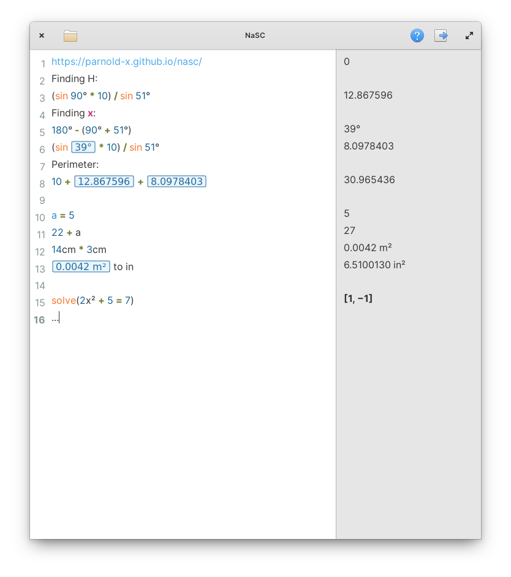

<div align="center">
  <span align="center"> </span>
  <h1 align="center">NaSC</h1>
  <h3 align="center">Do maths like a normal person</h3>
</div>



NaSC is an app where you do maths like a normal person. It lets you type whatever you want and smartly figures out what is math and spits out an answer on the right pane. Then you can plug those answers in to future equations and if that answer changes, so does the equations it's used in.

## Installation
[](https://appcenter.elementary.io/com.github.parnold-x.nasc)

## Building
Dependencies:

```
apt install -y gobject-introspection libgee-0.8-dev libwebkit2gtk-4.0-dev libgtksourceview-3.0-dev libcln-dev libgranite-dev libcurl4-openssl-dev libmpfr-dev intltool meson valac
```

then build with:
 
```
meson build --prefix=/usr
ninja -C build install
```
